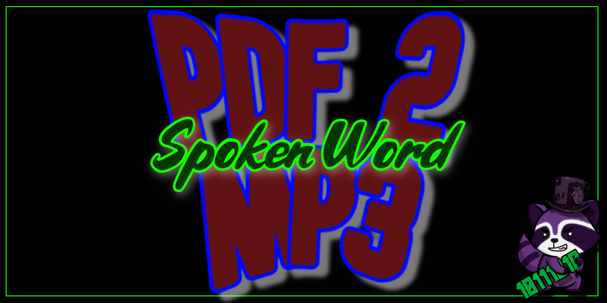

# pdf_2_mp3
## Simple python program to convert a PDF file into a spoken word mp3 file.

Hope you find this converter useful. If like myself you sometimes prefer to listen to a document instead of reading it then this is a program for you.

Its simple to use.  It will give you the choices of 'male' of 'female' voices (Both sound like robots) to use and you can set the words per min speed of the spoken voice. Other than that point it at the pdf file and just let it do its thing.

### Told you it was simple.
## Enjoy.
